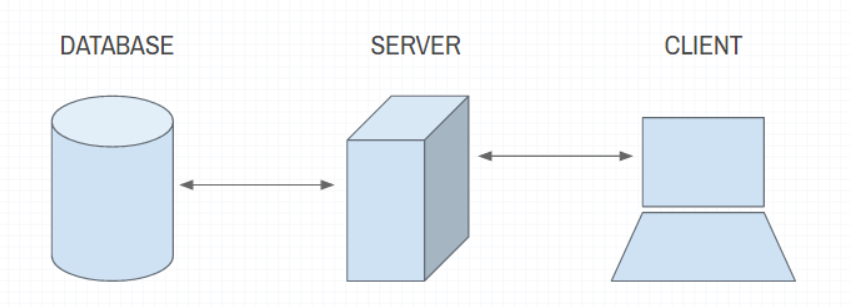
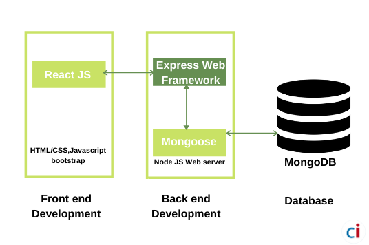

# Movies-Library
Task-11
# Project Name : MOVIES LIBRARY
# Project Version : version-1

**Author Name**: Amer abu-Hamameh

## WRRC

## Overview

## Getting Started
<!-- What are the steps that a user must take in order to build this app on their own machine and get it running? -->
1.  npm install
2.  node server.js

## Project Features
<!-- What are the features included in you app -->

How long did it take you to complete this assignment? 8h 
 before you started, how long did you think it would take you to complete this assignment? 3h